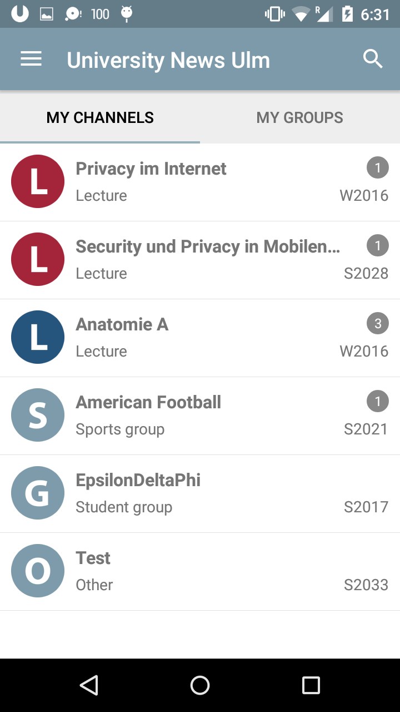

# UlmUniversityNewsAndroidApp

The extensive documentation of the whole project can be accessed here:

https://drive.google.com/open?id=0B2WzV7ndNZknYVIySXFrV180a2M

Unfortunately the documentation is available in German only.

You can find some screenshots of the Android App in the [Screenshots](Screenshots/) folder.

Example Screenshot:

